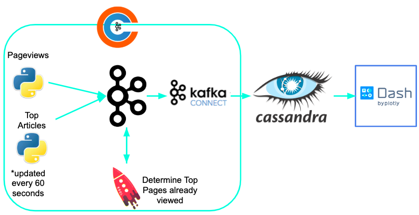

# New-news
My Insight Data Engineering project for the NY Winter 2019 session. New-news is an application that filter's suggestions based on a user's history.

A video demo of the application can be found [here](https://www.youtube.com/watch?v=SdwCd5N5NLg&feature=youtu.be)

# Motivation
According to a 2018 study by Chartbeat, online users are spending an average of 16 seconds on each page of the websites they track (mainly online periodicals). This shows that user engagement is an incredibly hard thing to retain. One way to improve user engagement is to not display content that is stale to the user. New-news fixes this problem by tracking user activity and ensuring that any suggestions listed on each page prioritize pages the user has not visited.

# Pipeline

New-news runs a pipeline on the AWS cloud, using the following cluster configurations:

* three m4.large EC2 instances for Kafka (Confluent platform with KSQL and Kafka Connectors)
* three m4.large EC2 instances for Cassandra
* one t2.micro EC2 instance to run the Dash front-end application

For the ingestion and analysis portion of my pipeline I am using the Confluent Kafka platform which offers a Kafka streams API built on top of Kafka. First data is generated for both pageviews and top-articles and ingest them into Kafka. Then KSQL (Kafka SQL) queries these streams of data and joins them to create a combined stream that tracks when a user has visited a top suggested article. The combined stream and the top-articles stream are then ingested into Cassandra using Confluent's Cassandra Sink Connector. Finally, it is possible to query the Cassandra database from a Dash frontend.

## Technologies Used
* Confluent Kafka **v5.1**
* Cassandra **v3.0.18**
* Dash **v0.39.0
* Python **v2.7**
