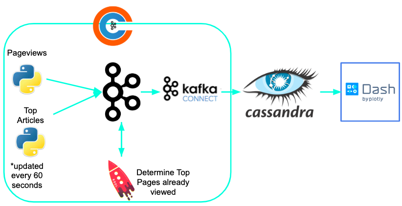

# New-news
My Insight Data Engineering project for the NY Winter 2019 session. New-news is an application that filter's suggestions based on a user's history.

A video demo of the application can be found [here](https://www.youtube.com/watch?v=fFACYU7QMPk).

# Table of Contents
1. [Motivation](README.md#Motivation)
2. [Pipeline](README.md#Pipeline)
3. [Starting Project](README.md#Starting-Project)
    1. [Setting Up Clusters](README.md#setting-up-clusters)
        1. [Confluent Kafka](README.md#setting-up-kafka)
        2. [Cassandra](README.md#setting-up-cassandra)
        3. [Dash](README.md#setting-up-dash)
    2. [Running New-news](README.md#running-new-news)

# Motivation
According to a 2014 study by Chartbeat, 55% of users are spending 15 seconds or less on each page on the websites they track (mainly online periodicals). This shows that user engagement is an incredibly hard thing to retain. One way to improve user engagement is to not display content that is stale to the user. New-news fixes this problem by tracking user activity and ensuring that any suggestions listed on each page prioritize pages the user has not visited.

# Pipeline

New-news runs a pipeline on the AWS cloud, using the following cluster configurations:

* three m4.large EC2 instances for Kafka (Confluent platform with KSQL)
* three m4.large EC2 instances for Cassandra
* one t2.micro EC2 instance to run the Dash front-end application

For the ingestion and analysis portion of my pipeline I am using the Confluent Kafka platform which offers a Kafka streams API built on top of Kafka. First data is generated for both pageviews and top-articles and ingest them into Kafka. Then KSQL (Kafka SQL) queries these streams of data and joins them to create a combined stream that tracks when a user has visited a top suggested article. The combined stream and the top-articles stream are then ingested into Cassandra using Confluent's Cassandra Sink Connector. Finally, it is possible to query the Cassandra database from a Dash frontend.

# Starting project

This guide makes use of Pegasus (documentation [here](https://github.com/InsightDataScience/pegasus)). The .yml files necessary to set up each individual cluster are found in ./config/pegasus. Make sure to input the subnet id, PEM keypair, and security group ids for your AWS account. Follow the pegasus installation instructions up through the end of the sections labelled "Setting up a newly provisioned AWS cluster" for your Kafka, Cassandra, and Dash clusters (note: Dash only has one node and thus has no workers).

## Setting up Clusters
### Setting up Confluent
Do the following on each Kafka machine:

Run this command: curl -O http://packages.confluent.io/archive/5.1/confluent-5.1.1-2.11.tar.gz

Check [this](https://docs.confluent.io/current/installation/installing_cp/zip-tar.html#prod-kafka-cli-install) page to make sure you are downloading the latest version (this is the version as of February 14, 2019)

Unzip the file and rename the parent directory to confluent.

Next you need to use the files list in this repository under ./config/confluent and update the corresponding files on each Kafka node located in the following directories
* confluent/etc/kafka/zookeeper.properties
* confluent/etc/kafka/server.properties
* confluent/etc/schema-registry/schema-registry.properties
* confluent/etc/schema-registry/connect-avro-distributed.properties
* confluent/etc/confluent-control-center/control-center.properties
* confluent/etc/ksql/ksql-server.properties

Make sure to update any public DNS addresses or private IPs listed in these files to match the configuration of your servers

### Setting up Cassandra
On each Cassandra node, install the most recent Cassandra 3.0 download from [this](https://cassandra.apache.org/download/) page. Then, go to <path-to-Cassandra>/conf and edit the cassandra.yaml file according to the directions under the "Configure Cassandra" headline on [this](https://github.com/InsightDataScience/data-engineering-ecosystem/wiki/cassandra) page. Make sure to run the "cassandra" command to build the configuration after you are done editing the cassandra.yaml file.

### Setting up Dash
Transfer all files from the ./src/app folder into dash and then follow [this](https://www.digitalocean.com/community/tutorials/how-to-deploy-python-wsgi-apps-using-gunicorn-http-server-behind-nginx) tutorial to host the dash app on your dash server.

## Running New-news
